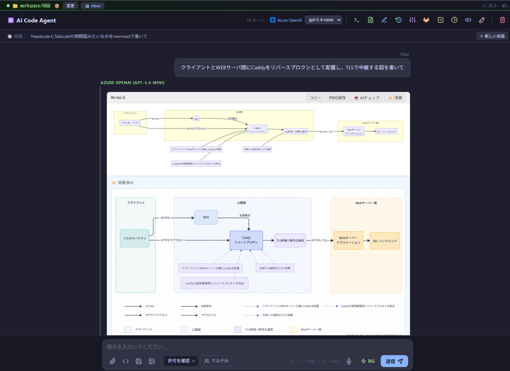
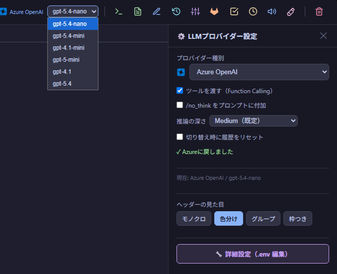
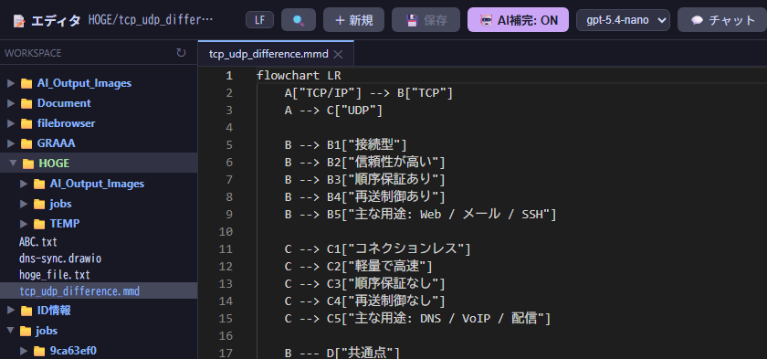

# AI Code Agent

[](LICENSE)
[](https://www.python.org/)
[](https://fastapi.tiangolo.com/)
[](#7つのllmプロバイダーを1つのuiで)
[](#対応環境)

**「チャットで指示するだけ」で、コードを書き・実行し・図を描き・ファイルを操作し・Web を調べ、結果を報告してくれる自律型 AI エージェント。**

ブラウザのチャット欄に日本語で頼むだけ。AI が自分でツールを選び、ファイルを読み書きし、コマンドを実行し、必要なら Web を調べて、完成物を返してくれます。Azure OpenAI・OpenAI・Gemini・Groq・OpenRouter・ローカル LLM を **1 つの UI で切り替え**ながら使えるのが最大の特徴です。

> 30 年のフルスタック／インフラエンジニア経験から生まれた個人開発プロジェクト。
> 「現場で本当に使えるエージェント」を目指して、コード生成だけでなく **インフラ図・Office 文書・Ansible・Windows 操作・スケジュール実行** まで一気通貫で扱えるよう作り込んでいます。

---

## デモ

### 💬 チャットで頼むだけ — 図も自動生成・AI が清書まで
「Caddy をリバースプロキシに置いて TLS 中継する図を書いて」と頼むと、Mermaid で構成図を生成し、ワンクリックで**清書（きれいな画像化）**まで行います。



### 🔀 7 つの LLM プロバイダーを 1 つの UI で
画面右上のプルダウンから、**Azure OpenAI / OpenAI / Gemini / Groq / OpenRouter / ローカル LLM** をワンクリックで切り替え。会話を続けたままモデルを変えられるので、「軽い用件は nano、難しいところだけ上位モデル」という使い分けが自然にできます。



### 📝 ブラウザ内に VSCode 相当の Monaco エディタ
ファイルツリー付きのマルチタブエディタを内蔵。AI が生成したファイルをその場で開いて確認・手直しできます。ドラッグ＆ドロップ移動・AI インライン補完にも対応。



---

## このエージェントの面白いところ

一般的な AI チャット（ブラウザで会話するだけ）と違い、**手と足を持っている**のが本質です。

| よくある AI チャット | このエージェント |
|---|---|
| 文章を返すだけ | **実際にファイルを読み書き・コマンド実行・Web 調査して成果物を作る** |
| 1 つのモデルに固定 | **7 プロバイダーを会話中に切り替え**・失敗時は別モデルへ自動フォールバック |
| コードはコピペで自分で動かす | **bubblewrap サンドボックスで安全に実行**して結果まで確認 |
| 図は描けない | **Mermaid / draw.io / Manim** を生成、AI が清書して画像化 |
| Office は扱えない | **Word / Excel / PowerPoint / PDF** を直接読み書き |
| クラウド前提 | **ローカル LLM だけでも完結**（社内・オフライン環境で動く） |

### 特に作り込んだポイント

- **🛡️ 安全第一の実行環境** — コマンドは bubblewrap サンドボックス内で実行。`rm` のパストラバーサルや作業ディレクトリ外への削除を多層でブロック。破壊的操作は承認モーダルで確認。
- **🧭 3 つの実行モード** — 「許可を確認」「プランモード（読み取り専用で計画だけ立てる）」「自動」をワンクリックで切り替え。Claude Code のプランモードに着想を得た設計。
- **🔁 別モデルで再実行** — 回答が不満なら、各ターンの下のバーから**プロバイダーを横断して**ワンクリックで投げ直し。「nano で試して、ダメなら mini」が手作業ゼロ。
- **⏰ 定時実行スケジューラー** — 「毎朝 9 時にこのチェックを回して、異常ならメール通知」を自然言語で登録。曜日指定・取りこぼし補完つき。
- **🔌 MCP クライアント内蔵** — Playwright（ブラウザ操作 23 ツール）・Obsidian など任意の MCP サーバーを接続。クラッシュ時は自動再接続。
- **🧠 RAG 知見データベース** — `rag_save` で記録した知識を AI が自律的に検索・参照し、プロジェクト固有のノウハウを活用。
- **✅ 保存時の自動検証ループ** — ファイル保存時に py_compile / json / yaml / bash -n / node --check を自動実行。AI が自分の構文エラーに気づいて直す。
- **🪟 WSL2 から Windows をネイティブ操作** — PowerShell・WinGet・レジストリ・GUI アプリ起動まで（`run_powershell`）。

---

## 7 つの LLM プロバイダーを 1 つの UI で

| プロバイダー | 用途・特徴 |
|---|---|
| **Azure OpenAI** | メイン。gpt-5.4-mini を基本に、nano（軽量・高速）／gpt-4.1（高精度）へ即切替 |
| **Azure AI Foundry** | 複数インスタンスを並列定義可能 |
| **OpenAI（本家）** | API キー直結 |
| **Google Gemini** | Gemini 2.5 Flash / Pro |
| **Groq** | 超高速推論（無料枠はチャット専用の軽量モード） |
| **OpenRouter** | 1 つのキーで多数のモデルにアクセス・**モデル間自動フォールバック**対応 |
| **ローカル LLM** | Ollama / LM Studio / vLLM（Qwen3 等）。**完全オフライン動作** |

会話中にモデルを切り替えてもセッションは継続。プロバイダーごとに「推論の深さ（low / medium / high）」も調整できます。

---

## 主な機能

<details>
<summary><b>コード・ファイル操作</b></summary>

- ファイルの読み書き・編集・ディレクトリ一覧・glob・grep
- コマンド実行（bubblewrap サンドボックス、タイムアウト・ホワイトリスト付き）
- バックグラウンドプロセス起動・監視・停止
- コード静的解析（Python: ruff / JS・TS: eslint）
- Manim アニメーション生成

</details>

<details>
<summary><b>Monaco テキストエディタ（ブラウザ内 VSCode 相当）</b></summary>

- ファイルツリー付きのマルチタブエディタ（別タブで独立表示）
- ドラッグ＆ドロップでファイル移動
- AI インライン補完（Ctrl+Space）
- 未保存変更の警告、自動言語検出

</details>

<details>
<summary><b>Web 調査</b></summary>

- Web 検索（Tavily → DuckDuckGo → SearXNG フォールバック）
- URL テキスト取得・詳細調査（複数ページ横断）

</details>

<details>
<summary><b>Office / ドキュメント</b></summary>

- Word（.docx）/ Excel（.xlsx）/ PowerPoint（.pptx）の読み書き・編集
- PDF 読み取り（pdfplumber）・PDF 生成（fpdf2、日本語対応）
- ファイルはチャット欄へドラッグ＆ドロップでアップロード

</details>

<details>
<summary><b>ダイアグラム・画像</b></summary>

- Mermaid 図を生成し、AI が清書してきれいな画像に
- draw.io ダイアグラムをチャット内でプレビュー・「📐 Draw.io で開く」ボタンで直接編集
- 画像生成（gpt-image 系）・自動ウォーターマーク

</details>

<details>
<summary><b>RAG 知見データベース</b></summary>

- `rag_save` で記録、`rag_search` で類似検索（ベクトル DB）
- モデルが自律的に参照してプロジェクト固有の知識を活用

</details>

<details>
<summary><b>GitLab / GitHub 連携</b></summary>

- イシュー・MR 閲覧・作成・コメント
- リポジトリクローン・ブランチ操作
- コミット・push（PAT 認証）

</details>

<details>
<summary><b>Ansible 実行</b></summary>

- プレイブック一覧のチェックボックス選択 → 実行・ストリーム表示

</details>

<details>
<summary><b>Windows ネイティブ操作（WSL2 環境）</b></summary>

- PowerShell コマンド実行（`run_powershell`）
- WinGet・レジストリ操作・GUI アプリ起動

</details>

<details>
<summary><b>定時実行スケジューラー</b></summary>

- 「毎日 / 平日のみ / 曜日指定」で定時タスクを登録
- 取りこぼし補完（12h）・冪等実行
- 結果は専用カードでチャットに表示・条件付きメール通知

</details>

<details>
<summary><b>セッション管理</b></summary>

- 会話履歴の保存・復元・アーカイブ・保護（消えない設定）
- 長い会話は自動圧縮（コンテキスト節約）

</details>

<details>
<summary><b>MCP クライアント</b></summary>

- `config/mcp_servers.json` で任意の MCP サーバーを接続・管理（`/setup` UI から設定可）
- **Playwright MCP** — ブラウザ操作ツール群（23 ツール）を LLM から直接呼び出し
- **Obsidian MCP** — Obsidian Vault のノート読み書き・検索
- MCP クラッシュ時は自動再接続

</details>

<details>
<summary><b>通知・スキルシステム</b></summary>

- Gmail メール通知（エラー時・「メールで通知して」指示時・クールダウン付き）
- `skills/*/SKILL.md` にスラッシュコマンドを定義するだけで即反映（再起動不要）
- 標準スキル: `/commit` `/get-proj` `/save` `/ansible` `/boost` `/archive`

</details>

---

## 対応環境

| 環境 | 起動方法 |
|---|---|
| **Linux / WSL2**（推奨） | systemd サービス（`ai-codeagent.service`）で常駐 |
| **Windows ネイティブ** | タスクトレイアイコン常駐（`start.bat` → `tray.py`）|

---

## セットアップ

→ 詳細は **[docs/setup.md](docs/setup.md)** を参照

```bash
# Linux / WSL2
git clone https://github.com/yuichi109/AI-Codeagent-public.git AI-Codeagent
cd AI-Codeagent
chmod +x setup.sh   # Windows側エディタ経由だと実行権限が落ちるため
./setup.sh install
# ブラウザで http://localhost:8000/setup を開いて API キーを設定
```

```bat
rem Windows ネイティブ版（ユーザープロファイル配下に置くこと。Program Files は不可）
git clone https://github.com/yuichi109/AI-Codeagent-public.git AI-Codeagent-win
cd AI-Codeagent-win
git checkout for_windows
start.bat
```

> **前提ソフト（Python / Git / Node.js）が事前に入っていれば一般ユーザー権限で完結します。**
> 未インストールの場合は `start.bat` が途中で winget による自動インストールを行い、**その際に管理者昇格（UAC）が必須**です（Git・Node.js はマシン全体に導入されるため）。
> Node.js は MCP / Playwright を使う場合のみ必要（無くても本体は動作）。
> 初回だけ管理者で 3 つを入れておけば、以降は昇格なしで起動できます。詳細・Windows Server 2025 の注意は [docs/setup.md](docs/setup.md) を参照。

---

## 起動・停止（Linux / WSL2）

```bash
# 起動・停止・再起動
sudo systemctl start ai-codeagent
sudo systemctl stop ai-codeagent
sudo systemctl restart ai-codeagent

# ログ確認
journalctl -u ai-codeagent -n 50
```

ブラウザで **http://localhost:8000** を開く。

---

## 必要な設定（.env）

最小構成（Azure OpenAI の例）:

```env
AZURE_OPENAI_API_KEY=...
AZURE_OPENAI_ENDPOINT=https://xxx.openai.azure.com
AZURE_OPENAI_DEPLOYMENT=gpt-5.4-mini
AZURE_OPENAI_DEPLOYMENTS=gpt-5.4-mini,gpt-4.1-mini,gpt-4.1
AZURE_OPENAI_API_VERSION=2025-01-01-preview
```

その他の設定項目（OpenAI・Gemini・Groq・OpenRouter・ローカル LLM・GitLab PAT・SearXNG・メール通知 等）は `.env.example` を参照、もしくは起動後に **`/setup` 画面**から GUI で設定できます。

---

## アーキテクチャ

```
server.py           ← FastAPI + SSE ストリーミング、ツールレジストリ
config.py           ← .env 読み込み（各プロバイダー / workspace 設定）
prompts.py          ← 自律エージェント用システムプロンプト
agent_core.py       ← バックグラウンド / 定時タスク用エージェントループ
tools/
  file_tools.py     ← read / write / edit / list / glob / grep
  command_tools.py  ← run_command（bubblewrap サンドボックス）
  web_tools.py      ← web_search / web_fetch / web_research
  office_tools.py   ← Word / Excel / PowerPoint
  pdf_tools.py      ← PDF 読み取り
  windows_tools.py  ← run_powershell（WSL2 → Windows 操作）
  ...
index.html          ← チャット UI（ストリーミング・Monaco エディタ・tool 履歴）
skills/             ← スキルファイル（再起動不要で即反映）
workspace/          ← エージェントの作業ディレクトリ
```

---

## ドキュメント

| ファイル | 内容 |
|---|---|
| [docs/setup.md](docs/setup.md) | 詳細セットアップ手順（WSL2 / Windows） |
| [docs/changelog.md](docs/changelog.md) | 実装済み機能の変更履歴 |
| [docs/roadmap.md](docs/roadmap.md) | 今後の実装予定 |
| [docs/test-checklist.md](docs/test-checklist.md) | テスト確認項目 |

---

## ロードマップ

3 段階の進化を構想しています。

1. **Stage 1：万能シングル AI**（現在）— 自律的に動いて成果物を作り報告できる多機能エージェント
2. **Stage 2：マルチ AI エージェント**（実装中）— 起案 → 設計 → 構築 → デバッグ → テスト → 報告を役割分担
3. **Stage 3：クラウド統合エンジニア AI**（最終目標）— Azure / vSphere 等を能動的に利用し、スナップショットでクリーン環境を保証

---

## 作者

**yuichi109** — [GitHub](https://github.com/yuichi109) / [GitLab](https://gitlab.com/yuichi.matsuo)

## ライセンス

[MIT License](LICENSE) © 2026 yuichi109
